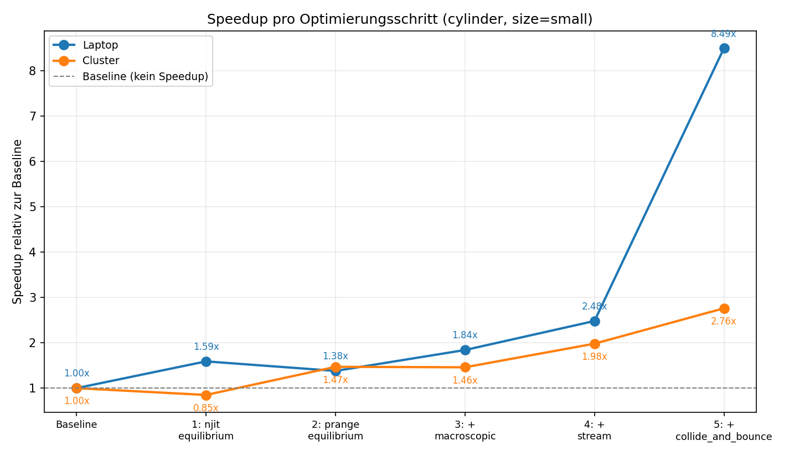
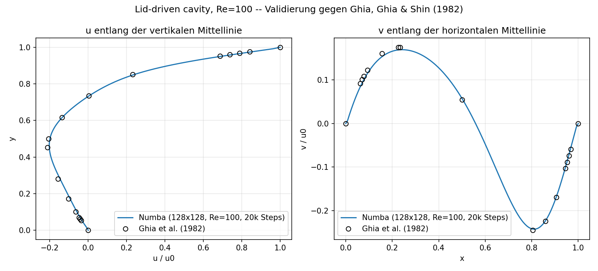
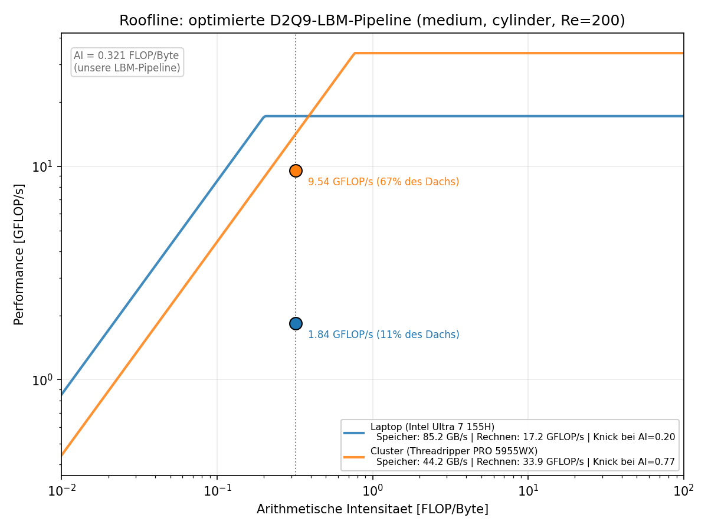
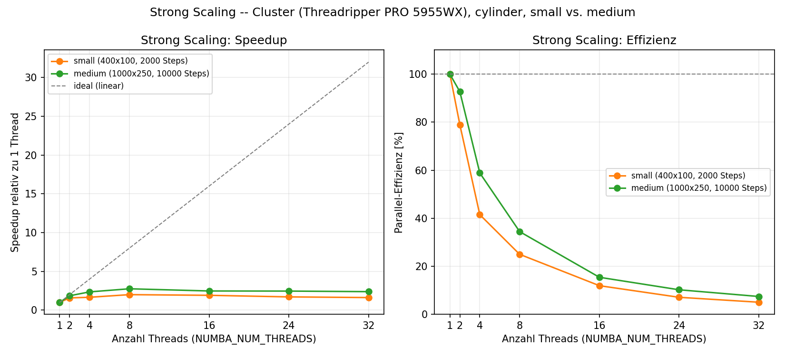

# Beschleunigung eines Lattice-Boltzmann-Fluidlösers mit Numba

**HPC-Projekt 04 — Lattice Boltzmann**
Einzelarbeit, FHNW

---

## 1. Einleitung

Ausgangspunkt dieses Projekts ist ein bewusst naiver, reiner NumPy-Löser für die
Lattice-Boltzmann-Methode (D2Q9), der Strömungen über zwei Testfälle simuliert: Die Umströmung
eines Zylinders (Kármánsche Wirbelstrasse, Re = 200) und die deckelgetriebene Kavität
(Lid-Driven Cavity, Re = 100). Ziel der Arbeit ist es, diesen Löser mit **genau einer**
HPC-Optimierungsstrategie deutlich zu beschleunigen — für Einzelarbeit reicht laut
Aufgabenstellung eine Strategie —, die Korrektheit dabei lückenlos nachzuweisen, die Performance
mit einer Roofline-Analyse und einer Scaling-Studie einzuordnen, und die Physik der optimierten
Version gegen eine unabhängige Referenz zu validieren.

Gewählte Strategie: **Numba**, zunächst `@njit`, danach `@njit(parallel=True)` mit `prange` für
alle vier Kernfunktionen des Lösers (`equilibrium`, `macroscopic`, `stream`,
`collide_and_bounce`). Die Wahl baut direkt auf dem Kursmaterial (`01_Python/03_Numba.ipynb`) auf
und benötigt kein GPU-Setup.

Gemessen wurde durchgehend auf zwei Maschinen: Einem lokalen Windows-Laptop (Intel Core Ultra 7
155H, 16 Kerne / 22 logische Prozessoren) und dem FHNW-Cluster `pub030` (JupyterHub-Knoten
`calc-g-jhub`, AMD Ryzen Threadripper PRO 5955WX, 16 Kerne / 32 Threads). Wo die beiden Maschinen
unterschiedliche Ergebnisse liefern, wird das explizit diskutiert statt geglättet — das ist Teil
der Erkenntnisse dieser Arbeit.

---

## 2. Baseline: Profiling und Analyse

Ein `cProfile`-Lauf der Baseline (`cylinder`, 400×100, 500 Steps, ~2.7 s Gesamtlaufzeit) zeigt
folgende grobe Aufteilung der Laufzeit:

| Funktion / Codeteil | Anteil an der Laufzeit |
|---|---|
| `equilibrium()` (501 Aufrufe) | ~39% |
| `run()`-Körper: Randbedingungen, Kollision, Bounce-back-Schleife | ~31% |
| `macroscopic()` (501 Aufrufe) | ~15% |
| `stream()` (500 Aufrufe, davon ~65% reines `np.roll`) | ~15% |

Das deckt sich nur teilweise mit der Einordnung im Projekt-README, wonach LBM primär durch
Streaming und Speicherbandbreite dominiert wird: `equilibrium()` und die Bounce-back-Schleife
kosten in der Baseline mindestens genauso viel wie `stream()`. Die Arbeitshypothese: Ein grosser
Teil davon ist Python-Loop- und Temporär-Array-Overhead (9 Richtungen, bei jedem Aufruf frische
NumPy-Arrays), nicht reine Speicherbandbreite — genau das sollte ein Numba-Kernel angehen, der
das nicht mehr braucht.

Zusätzlich zeigt sich beim direkten Maschinenvergleich: Dieselbe Baseline (`cylinder`, `small`)
läuft auf dem Cluster bereits ~1.9× schneller als auf dem Laptop (5.58 s vs. 10.45 s) — allein
durch unterschiedliche Hardware/NumPy-Builds, ohne jede Optimierung. Für das weitere Vorgehen
folgt daraus: **vergleichbar sind Speedup-Faktoren, nicht absolute Laufzeiten über Maschinen
hinweg**, und die abschliessend berichteten Zahlen sollten von der Referenzmaschine `pub030`
stammen.

---

## 3. Gewählte Strategie und Vorgehen

**Numba `@njit(parallel=True)` mit `prange`**, schrittweise auf alle vier Kernfunktionen
angewendet, mit einer bewussten Fusion von Kollision und Bounce-back in einem letzten Schritt.
Das Vorgehen war iterativ: Pro Schritt eine Funktion umbauen, mit `validate.py` gegen die
unveränderte Baseline verifizieren, auf beiden Maschinen benchmarken, Ergebnis interpretieren —
und, wo ein Ergebnis überraschend war, zuerst nach einem Mess-Fehler suchen, bevor eine
inhaltliche Erklärung gesucht wird (siehe Abschnitt 4.3).

---

## 4. Implementierung

### 4.1 Schritt 1 — `@njit` auf `equilibrium()`, Funktionskörper unverändert

Nur der Decorator wurde ergänzt, der Code blieb ein Python-Loop über die 9 Gitterrichtungen mit
vollen NumPy-Array-Ausdrücken pro Iteration (`cu = 3.0 * (C[i,0]*ux + C[i,1]*uy)` usw.).

| Maschine | Baseline | Schritt 1 | Speedup |
|---|---|---|---|
| Laptop | 10.45 s | 6.59 s | **1.59×** |
| Cluster | 5.58 s | 6.54 s | **0.85× (langsamer!)** |

Überraschend und maschinenabhängig: Auf dem Laptop hilft `@njit` sofort, auf dem Cluster wird der
Code langsamer — reproduzierbar über zwei unabhängige Cluster-Läufe (6.54 s / 6.37 s), also kein
einmaliges Rauschen. Erklärung: `@njit` allein ändert nicht *was* berechnet wird, nur *wie* es
kompiliert wird. Der Code bleibt im Kern "auf ganzen Arrays mit Temporären rechnen" — das tritt
direkt gegen NumPys eigene, gut vektorisierte Elementweise-Operationen an. Auf einer starken
Server-CPU mit gut vektorisiertem NumPy-Build gewinnt NumPy diesen Wettkampf; auf dem Laptop war
NumPys Overhead pro Aufruf/Temporär-Array offenbar proportional grösser, weshalb Numba dort schon
in dieser Form half. 

**Konsequenz:** Der eigentliche Numba-Vorteil sollte erst mit einem expliziten
Scalar-Loop über die Gitterzellen kommen, nicht mit einer blossen Dekorierung der bestehenden
Array-Ausdrücke.

### 4.2 Schritt 2 — Umbau zu explizitem Scalar-Loop mit `prange`

`equilibrium()` wurde zu `for x in prange(nx): for y in range(ny): ...` umgebaut, mit rein
skalarer Rechnung pro Zelle statt Array-Ausdrücken.

| Maschine | Baseline | Schritt 1 | Schritt 2 |
|---|---|---|---|
| Laptop | 10.45 s | 6.59 s (1.59×) | 7.57 s (**1.38×**, schlechter als Schritt 1!) |
| Cluster | 5.58 s | 6.54 s (0.85×) | 3.80 s (**1.47×**, viel besser als Schritt 1!) |

Das Bild kehrt sich zwischen den Maschinen um. 

**Eine erste Hypothese (Parallel-Dispatch-Overhead skaliert mit der Kernzahl:** Laptop 22 logische Prozessoren vs. Cluster 32 Kerne) wurde anhand der
tatsächlichen Kernzahlen verworfen — der Unterschied (Faktor ~1.45) ist zu klein, um einen so
starken Umschwung zu erklären. 

**Die andere, im Rahmen dieser Arbeit nicht abschliessend bewiesene Hypothese:** Es geht nicht nur um die Kernzahl, sondern um *wie* die Kerne beschaffen
sind (der Laptop hat vermutlich heterogene Performance-/Efficiency-Kerne, der Cluster 32
gleichwertige Server-Kerne) und um die verfügbare Speicherbandbreite pro Kern — ein Muster, das
sich in Abschnitt 7 (Roofline) mit echten Messungen bestätigt.

### 4.3 Schritt 3 — `macroscopic()`, und eine wichtige Mess-Lektion

Gleiches Muster wie bei `equilibrium()`. **Wichtiger Fund unterwegs:** `macroscopic()` wird — anders
als `equilibrium()` — zum ersten Mal *innerhalb* der Zeitschritt-Schleife aufgerufen, also nach
dem Start der Zeitmessung. Ohne einen expliziten Warm-up-Aufruf davor wurde beim ersten
Schleifendurchlauf die JIT-Kompilierzeit mitgemessen:

| Maschine | Schritt 2 | + macroscopic, **ohne** Warm-up-Fix | + macroscopic, **mit** Warm-up-Fix |
|---|---|---|---|
| Laptop | 7.57 s | 5.97 s | **5.69 s (1.84×)** |
| Cluster | 3.80 s | 4.49 s (wirkte wie Rückschritt!) | **3.83 s (1.46×, praktisch neutral)** |

Die zuvor beobachtete "Verschlechterung" auf dem Cluster war grösstenteils ein Mess-Artefakt, kein
echter Parallelisierungs-Overhead. 

**Lehre fürs weitere Vorgehen:** Ein unerwartetes Ergebnis zuerst
auf einen Mess-Fehler prüfen (hier: Fehlendes Warm-up), bevor eine inhaltliche Erklärung gesucht
wird — dieselbe Disziplin wurde bei `collide_and_bounce` in Schritt 5 direkt angewendet.

### 4.4 Schritt 4 — `stream()`: Der bisher klarste Gewinn

Ersetzt wurden zwei verschachtelte `np.roll`-Aufrufe (die laut Docstring der Baseline "the single
biggest source of memory traffic in the whole solver" sind) durch direkte Indexberechnung:
`src = (x - C[i]) % n`, keine Zwischenkopie.

| Maschine | Schritt 3 | Schritt 4 | Speedup gesamt |
|---|---|---|---|
| Laptop | 5.69 s (1.84×) | **4.21 s / 19.015 MLUPS** | **2.48×** |
| Cluster | 3.83 s (1.46×) | **2.82 s / 28.409 MLUPS** | **1.98×** |

Erster Schritt mit klarem, konsistentem Gewinn auf **beiden** Maschinen — passend zur
Baseline-Analyse, in der `np.roll` ~65% der `stream()`-Zeit ausmachte.

### 4.5 Schritt 5 — Fusion von Kollision und Bounce-back

`fpost = f - omega*(f-feq)` und die separate Bounce-back-Schleife (boolesches Fancy-Indexing,
bekannt für schlechten, nicht-zusammenhängenden Speicherzugriff) wurden zu einer Funktion
`collide_and_bounce()` fusioniert: Pro Zelle wird direkt entschieden, ob Bounce-back oder normale
BGK-Kollision gilt, ohne Zwischen-Array.

| Maschine | Schritt 4 | Schritt 5 | Speedup gesamt |
|---|---|---|---|
| Laptop | 4.21 s (2.48×) | **1.23 s / 65.175 MLUPS** | **8.49×** |
| Cluster | 2.82 s (1.98×) | **2.02 s / 39.633 MLUPS** | **2.76×** |

**Der grösste Einzelschritt:** Hier fallen zwei teure Dinge gleichzeitig weg (Fancy-Indexing-Zugriff
und eine weitere Temporär-Array-Allokation).

### 4.6 Entscheidung: Keine vollständige Kernel-Fusion mehr

Bewusster Stopp an dieser Stelle: Alle vier Kernfunktionen sind jetzt `@njit(parallel=True)`,
decken die grosse Mehrheit der ursprünglich profilten Laufzeit ab, und der Speedup ist bereits
sehr deutlich (8.49× / 2.76×). Eine vollständige Fusion zu einem einzigen Kernel (inklusive
Randbedingungen) wäre der nächste mögliche Schritt gewesen — ich habe mich aber bewusst dagegen
entschieden, um auch die übrigen, ebenfalls benoteten Teile der Aufgabe (Roofline, Scaling,
Physik-Validierung, dieser Report) noch sauber fertigzustellen.

Diese Entscheidung hat einen konkret bezifferbaren Preis. Jede der vier Funktionen liest und
schreibt ihr Ergebnis gerade vollständig in den Speicher, bevor die nächste Funktion startet.
Eine vollständig fusionierte Version würde stattdessen alles für eine Zelle in einem einzigen
Durchgang berechnen und nur einmal lesen sowie einmal schreiben müssen — das entspricht rein
rechnerisch rund 144 Bytes pro Zelle. Die aktuelle, nicht fusionierte Pipeline bewegt dagegen
552 Bytes pro Zelle (Herleitung in Abschnitt 7.1) — knapp das 3.8-fache an Speicherverkehr, der
bei einer vollständigen Fusion wegfallen würde.

### 4.7 Zusammenfassung aller Schritte

| Schritt | Laptop | Cluster |
|---|---|---|
| Baseline | 10.45 s / 7.656 MLUPS | 5.58 s / 14.344 MLUPS |
| 1: `@njit` equilibrium (Array-Ausdrücke) | 6.59 s (1.59×) | 6.54 s (0.85×, langsamer) |
| 2: `prange` equilibrium (Scalar-Loop) | 7.57 s (1.38×) | 3.80 s (1.47×) |
| 3: + macroscopic (mit Warm-up-Fix) | 5.69 s (1.84×) | 3.83 s (1.46×) |
| 4: + stream | 4.21 s (2.48×) | 2.82 s (1.98×) |
| 5: + collide_and_bounce | **1.23 s (8.49×)** | **2.02 s (2.76×)** |

*Speedup-Verlauf über die fünf Schritte, jeweils relativ zur unveränderten Baseline. Gut zu
erkennen: Schritt 1 wirkt auf den beiden Maschinen gegensätzlich (siehe Abschnitt 4.1), ab
Schritt 2 steigen beide Kurven, und Schritt 5 bringt auf beiden Maschinen den grössten Sprung.*

Warum die Optimierung so viel bringt — nicht mehr Rechenleistung, sondern weniger
Speicherverkehr: Die Physik und damit die Anzahl Rechenoperationen sind bei Baseline und
optimierter Version identisch, aber NumPy legt bei jedem einzelnen Rechenschritt (`ux*ux`, `+`,
`*1.5`, ...) ein eigenes temporäres Array im Speicher an, während der Numba-Scalar-Loop alles pro
Zelle direkt in Prozessor-Registern durchrechnet und nur das Endresultat in den Speicher
schreibt.

**Am Beispiel `equilibrium()` von Hand durchgerechnet** — das heisst hier: Zeile für Zeile im
Code nachgezählt, wie viele Bytes dabei jeweils gelesen bzw. geschrieben werden, statt es mit
einem Mess-Tool zu erfassen: Die Baseline bewegt dafür rund 1944 Bytes/Zelle, die optimierte
Version nur 96 Bytes/Zelle — Faktor ~20, bei exakt gleicher Rechenarbeit. Für die übrigen drei
Kernel liesse sich das grundsätzlich genauso herleiten, aber ohne ein echtes
Memory-Profiling-Tool wäre das Ergebnis nicht zuverlässig genug für eine belastbare Gesamtzahl —
deshalb bleibt es hier bei diesem einen, klar nachvollziehbaren Beispiel statt einer unsicheren
Schätzung für die gesamte Baseline-Pipeline.

---

## 5. Korrektheit

`validate.py` (rtol 1e-6) meldet **PASS** auf beiden Maschinen für jeden einzelnen Schritt 1–5,
für beide Testfälle (`cylinder` und `cavity`), sowohl bei `small` als auch bei `medium`. Für die
Schritte 1, 2, 4 und 5 ist die Übereinstimmung sogar **bit-identisch** (`max rel err 0.000e+00`) —
erwartbar, da keine dieser Umformungen die Reihenfolge von Gleitkomma-Reduktionen ändert. Auch
Schritt 3 (`macroscopic`) bleibt exakt.

Der `cavity`-Fall, mit der vollen optimierten Pipeline nie vorher getestet, wurde separat
verifiziert:

| Maschine | Baseline | Optimiert | Speedup | Korrektheit |
|---|---|---|---|---|
| Laptop | 11.34 s (7.055 MLUPS) | 1.52 s (52.593 MLUPS) | 7.46× | OK |
| Cluster | 5.20 s (15.372 MLUPS) | 2.06 s (38.878 MLUPS) | 2.52× | OK |

Für die Ghia-Validierung (Abschnitt 6) wurde zusätzlich ein quadratisches 128×128-Gitter
(Re = 100, 20'000 Steps) geprüft: Baseline und optimierte Version liefern auch dort
bit-identische Felder (`ux`, `uy`, `rho` alle `PASS`, `max rel err 0.000e+00`).

---

## 6. Physik-Validierung: Vergleich mit einer unabhängigen Referenz (Ghia et al., 1982)

Bisher wurde nur geprüft, dass die optimierte Version exakt dieselben Zahlen liefert wie die
Baseline (Abschnitt 5) — das zeigt aber nur, dass beim Optimieren nichts kaputt gegangen ist, nicht,
dass die Simulation überhaupt physikalisch richtig rechnet. Dafür braucht es einen Vergleich mit
einer Quelle ausserhalb des eigenen Codes.

Für genau diesen Fall (die deckelgetriebene Kavität) gibt es einen häufig genutzten
Referenz-Datensatz von Ghia, Ghia & Shin aus dem Jahr 1982: Sie haben dieselbe Strömung mit einer
komplett anderen Methode durchgerechnet und ihre Ergebnisse als Tabelle veröffentlicht. Liefert
meine Simulation ähnliche Werte wie diese unabhängige Tabelle, ist das ein starkes Indiz, dass die
Physik stimmt.

Eine Einschränkung dabei: Die Ghia-Tabelle gilt nur für eine quadratische Kavität, das
Standard-Setup in diesem Projekt (`small`) ist aber mit 400×100 rechteckig. Für den Vergleich habe
ich deshalb extra ein quadratisches 128×128-Gitter simuliert, bei denselben physikalischen
Bedingungen wie in der Aufgabenstellung vorgesehen (Re = 100).

**Wie lange simulieren, bis das Ergebnis stabil ist?** Eine Strömungssimulation braucht eine
gewisse Anzahl Zeitschritte, bis sie sich eingeschwungen hat — das heisst: Bis sich die Werte von
Schritt zu Schritt praktisch nicht mehr ändern. Ich habe das geprüft, indem ich 10'000 und 20'000
Schritte verglichen habe. Bei 10'000 Schritten war ein Teil der Strömung (der kleine Wirbel in der
unteren Ecke der Kavität) noch spürbar zu schwach ausgeprägt; bei 20'000 Schritten lag das
Ergebnis deutlich näher an der Ghia-Referenz und hatte sich gegenüber 10'000 Schritten kaum mehr
verändert. Deshalb habe ich für den finalen Vergleich 20'000 Schritte verwendet.

**Ergebnis:** Verglichen habe ich zwei Geschwindigkeitsprofile — einmal entlang der senkrechten,
einmal entlang der waagrechten Mittellinie der Kavität. Beide stimmen sehr gut mit der Referenz
überein:

| Profil | grösste Abweichung | durchschnittliche Abweichung |
|---|---|---|
| Senkrechtes Profil (u) | 0.0208 | 0.0092 |
| Waagrechtes Profil (v) | 0.0078 | 0.0049 |

Zur Einordnung: Die Geschwindigkeiten in diesem Fall bewegen sich etwa zwischen −0.2 und 1.0, die
grössten Abweichungen liegen also im Bereich von 1–2%. Form und Verlauf beider Kurven stimmen
vollständig überein — an denselben Stellen, wo die Referenz die Strömungsrichtung wechselt, tut das
auch meine Simulation. Die kleinen Restunterschiede lassen sich einfach erklären: Ghia et al. haben
ein feineres Gitter (129×129) und eine andere Rechenmethode verwendet als LBM. Das ist normal und
erwartet, kein Hinweis auf einen Fehler.

*Die durchgezogene Linie ist meine Simulation, die Punkte sind die Ghia-Referenzwerte. Ein kleiner
technischer Hinweis zum Plot: Der Datenexport der Baseline setzt den Geschwindigkeitswert direkt am
Deckel fälschlicherweise auf 0 (ein Nebeneffekt der Randbedingungs-Maskierung) — für den Plot wurde
dieser eine Punkt deshalb auf den bekannten, tatsächlichen Wert (u = u0, also 1.0) korrigiert. Die
Tabelle oben war davon nicht betroffen, weil dieser Randpunkt dort von vornherein nicht mitgezählt
wurde.*

Als zusätzliche, unabhängige Kontrolle habe ich auch den zweiten Testfall angeschaut: Beim
`cylinder`-Fall bildet sich hinter dem Zylinder ein regelmässiges Wirbelmuster (die sogenannte
Kármánsche Wirbelstrasse), das mit einer festen Frequenz abreisst. Diese Frequenz lässt sich als
dimensionslose Kennzahl ausdrücken (Strouhal-Zahl); in meinen Scaling-Läufen (Abschnitt 8) ergab
sich ein Wert von 0.216 — nahe am für diese Strömung erwarteten Wert von etwa 0.2, und bei jeder
getesteten Thread-Zahl exakt gleich. Auch das spricht für eine physikalisch korrekte und
deterministische Simulation.

---

## 7. Roofline-Analyse

### 7.1 Arithmetische Intensität

Die arithmetische Intensität (kurz AI) beschreibt das Verhältnis zwischen Rechenarbeit und
Speicherverkehr: Wie viele Rechenoperationen (FLOPs) ein Programm pro Byte durchführt, das es aus
dem Speicher liest oder dorthin schreibt. Ist die AI hoch, verbringt ein Programm die meiste Zeit
mit Rechnen (rechenlimitiert); ist sie tief, verbringt es die meiste Zeit damit, auf Daten aus dem
Speicher zu warten (speicherlimitiert). Diese eine Zahl braucht es zuerst, bevor sich unser Löser
im Roofline-Diagramm weiter unten einordnen lässt.

Von Hand aus den vier Kernfunktionen hergeleitet — gleiches Vorgehen wie in Abschnitt 4.7: Zeile
für Zeile im Code nachgezählt, wie viele Bytes und Rechenoperationen pro Zelle und Zeitschritt
anfallen:

| Kernel | Bytes/Zelle | FLOPs/Zelle |
|---|---|---|
| `equilibrium` | 96 | 103 |
| `macroscopic` | 96 | 47 |
| `stream` | 144 | 0 |
| `collide_and_bounce` | 216 | 27 |
| **Summe** | **552** | **177** |

**AI = 177 / 552 ≈ 0.32 FLOP/Byte** — ein sehr tiefer Wert: Unser Löser verbringt also die
meiste Zeit mit Warten auf Speicherzugriffe, nicht mit Rechnen. Das bestätigt die im README
beschriebene Speicherbandbreiten-Limitierung von LBM. Eine ideal fusionierte Implementierung (ein
Lese-, ein Schreibdurchgang) bräuchte nur ~144 Bytes/Zelle — die aktuelle, nicht fusionierte
Pipeline bewegt das **3.8-fache**, der bereits in Abschnitt 4.6 bezifferte Preis dieser
Entscheidung.

### 7.2 Die Cache-Falle bei `small`

Bei `size=small` (400×100) ist das Arbeitsset (`f`, `feq`, `out`, `fpost`, je ~2.9 MB) nur
~12.5 MB gross — passt auf **beiden** Maschinen komplett in den L3-Cache (Laptop 24 MB, Cluster
64 MB). Die daraus berechnete "erreichte Bandbreite" lag deshalb sogar leicht über der
tatsächlichen DRAM-Bandbreite — kein Fehler, sondern ein Cache-Effekt. Für eine ehrliche Roofline
wurde deshalb `medium` verwendet (Arbeitsset ~78 MB, grösser als der L3-Cache auf beiden
Maschinen).

### 7.3 Gemessene Dächer

Statt Datenblatt-Werten wurden beide "Dächer" mit eigenen Mikrobenchmarks im selben
Programmierstil gemessen (`@njit(parallel=True)`/`prange`, kein manuelles SIMD):

- **Speicher-Dach** (`stream_bench.py`): STREAM-Triad, N = 100 Mio. Elemente, plus Korrektur um
  den Write-Allocate-Effekt (Faktor 4/3 — ein Schreibzugriff löst normalerweise zuerst ein
  "verstecktes" Lesen der Cache-Line aus, das eine naive Triad-Zählung nicht berücksichtigt).
- **Rechen-Dach** (`compute_bench.py`): Kleines, cache-residentes Array mit sehr vielen
  FMA-artigen Operationen, damit die Zeit rein von der Rechenleistung dominiert wird.

| Maschine | Rechen-Dach | Speicher-Dach (korrigiert) | Ridge Point |
|---|---|---|---|
| Laptop (Intel Ultra 7 155H) | 17.17 GFLOP/s | 85.23 GB/s | AI = 0.201 FLOP/Byte |
| Cluster (Threadripper PRO 5955WX) | 33.88 GFLOP/s | 27.07 GB/s | AI = 1.252 FLOP/Byte |

### 7.4 Interpretation

Bei unserer AI (0.321 FLOP/Byte) liegt der **Cluster** noch links von seinem eigenen Knick
(1.252) — also im speicherlimitierten Bereich — und erreicht dort **81%** seines eigenen
Speicher-Dachs (22.0 von 27.1 GB/s): Genau das erwartete Bild für einen
speicherbandbreiten-limitierten Stencil.

Der **Laptop** hat einen deutlich niedrigeren Knick (0.201, weil sein Speicher-Dach im Verhältnis
zur eigenen Rechenleistung ungewöhnlich hoch ist) — unsere Pipeline liegt bei ihm im Modell schon
im rechenlimitierten Bereich, erreicht dort aber nur **11%** des gemessenen Rechen-Dachs (1.84 von
16.7 GFLOP/s). Unabhängig davon, welches Dach man anlegt, bleibt der Laptop bei `medium` weit
unter jeder plausiblen Grenze — die Unterauslastung ist real, kein Artefakt der Modellwahl. Der
Laptop fällt bei `medium` sogar hinter den Cluster zurück (241 s vs. 62.7 s optimiert), obwohl er
bei `small` noch schneller war (1.23 s vs. 2.02 s) — ein Bild, das eine reine `small`-Messung
verschleiert hätte.

Zwei plausible, im Rahmen dieser Arbeit nicht abschliessend bewiesene Hypothesen dafür:

1. **Heterogene P-/E-Kerne**: `prange` verteilt Arbeit standardmässig in gleich grossen Chunks —
   bei genug Arbeit pro Chunk (wie bei `medium`) wartet die ganze Parallelregion auf die
   langsamsten Kerne, falls der Prozessor ungleich schnelle Kerne hat (wie beim Intel-Laptop
   typisch). Bei `small` war die Laufzeit zu kurz, damit dieser Effekt stark ins Gewicht fällt.
2. **Thermal Throttling**: Ein dünnes Laptop-Chassis kann unter mehreren Minuten Dauerlast
   (241 s bei `medium` vs. ~1 s bei `small`) die Taktfrequenz drosseln, ein Server-Node nicht in
   vergleichbarem Mass.

---

## 8. Scaling-Studie

### 8.1 Strong Scaling

Cluster (32 Kerne), Thread-Zahl über `NUMBA_NUM_THREADS` variiert, `cylinder`. Zwei
Problemgrössen gegenübergestellt:

| Threads | `small`: Speedup / Effizienz | `medium`: Speedup / Effizienz |
|---|---|---|
| 1  | 1.00× / 100.0% | 1.00× / 100.0% |
| 2  | 1.58× / 78.9%  | 1.85× / 92.7% |
| 4  | 1.66× / 41.5%  | 2.36× / 58.9% |
| 8  | **2.00× / 25.0%**  | **2.76× / 34.5%** |
| 16 | 1.91× / 12.0%  | 2.47× / 15.5% |
| 24 | 1.71× / 7.1%   | 2.46× / 10.2% |
| 32 | 1.62× / 5.1%   | 2.39× / 7.5% |

Beide Problemgrössen zeigen dasselbe qualitative Muster — ein Optimum bei **8 Threads**, danach
wird es wieder langsamer —, aber `medium` durchweg besser: Höherer Peak-Speedup (2.76× statt
2.00×), und bei 32 Threads fällt es nicht annähernd so tief ab wie bei `small` (dort war 32
Threads sogar schlechter als 2 Threads; bei `medium` bleibt jeder Mehr-Thread-Wert klar besser als
1 Thread). Erwartungsgemäss: Mehr Arbeit pro Thread verdünnt den Overhead der wiederholten
Parallelregion-Starts (4 Kernel-Aufrufe pro Zeitschritt).

Dass es aber auch bei `medium` ab 8 Threads bergab geht, hat einen zweiten Grund, der die
Roofline-Analyse unabhängig bestätigt: Bei `medium` erreicht der Cluster schon mit 32 Threads 81%
seiner eigenen Speicherbandbreite (Abschnitt 7) — ab dem Punkt, wo die Bandbreite der limitierende
Faktor ist, bringen weitere Threads keinen Zusatznutzen mehr, nur zusätzliche
Synchronisations-/Cache-Konkurrenz-Kosten. Zwei unabhängige Messungen (Roofline und Scaling)
zeichnen damit dasselbe Bild: **der Kernel ist speicherbandbreiten-limitiert, nicht
kernanzahl-limitiert** — mehr Kerne allein lösen das Problem nicht.

### 8.2 Weak Scaling

Eine Weak-Scaling-Studie (Problemgrösse proportional zur Kernzahl mitwachsen lassen) habe ich
bewusst nicht mehr zusätzlich durchgeführt. Die Strong-Scaling-Studie liefert zusammen mit der
Roofline-Analyse bereits ein konsistentes, unabhängig bestätigtes Bild der
Speicherbandbreiten-Limitierung — eine Weak-Scaling-Studie hätte voraussichtlich dieselbe
Kernaussage bestätigt, ohne substanziell neue Erkenntnisse zu liefern. Stattdessen habe ich die
Priorität auf die Ghia-Validierung und einen sauberen Report gelegt, da diese beiden für die
Bewertung mindestens genauso wichtig sind: Eine bewusste Priorisierung, keine vergessene
Deliverable.

---

## 9. Reflexion

**Was gut funktioniert hat:** Das iterative Vorgehen — eine Funktion pro Schritt, sofort mit
`validate.py` gegengeprüft, auf beiden Maschinen benchmarkt — hat zwei ernsthafte Mess-Fehler
frühzeitig aufgedeckt (fehlendes Warm-up bei `macroscopic()` in Schritt 3 und bei
`collide_and_bounce()` in Schritt 5), die sonst zu falschen Schlüssen über die Performance geführt
hätten. Die Entscheidung, konsequent zwei Maschinen zu messen, hat mehrfach ein Bild aufgedeckt,
das eine einzelne Maschine verschleiert hätte — am deutlichsten beim Rollentausch zwischen `small`
und `medium` (Laptop erst schneller, dann klar langsamer als der Cluster).

**Was nicht ideal lief, und warum die Entscheidung trotzdem richtig war:** Die vollständige
Kernel-Fusion (alle vier Funktionen zu einem einzigen Durchgang) habe ich bewusst nicht mehr
umgesetzt. Der in Abschnitt 7.1 bezifferte Preis dafür — 3.8× mehr Speicherverkehr als nötig — ist
real und wäre der naheliegendste nächste Schritt, besonders weil die Roofline zeigt, dass der
Cluster bereits nahe an seinem Speicher-Dach arbeitet: Weniger Speicherverkehr pro Zelle wäre dort
der direkteste Hebel für mehr Durchsatz. Trotzdem war der Stopp an dieser Stelle richtig: Der
bereits erreichte Speedup (8.49× / 2.76×) ist bereits sehr deutlich, und Roofline, Scaling-Studie
sowie Ghia-Validierung gehören genauso zur Bewertung wie die reine Optimierung — diesen Teilen
sauber Raum zu geben war mir wichtiger, als noch einen fünften Optimierungsschritt draufzusetzen.

**Kernaussage:** Der grösste Teil des erzielten Speedups kommt nicht daher, dass Numba schneller
rechnet, sondern daher, dass er weniger Speicherverkehr pro Zelle erzeugt (Abschnitt 4.7, Faktor
~20 allein bei `equilibrium()`) — bei einem durchweg speicherbandbreiten-limitierten Algorithmus
wie LBM ist das der eigentliche Hebel, nicht reine Rechengeschwindigkeit. Roofline-Analyse und
Scaling-Studie bestätigen das unabhängig voneinander.
